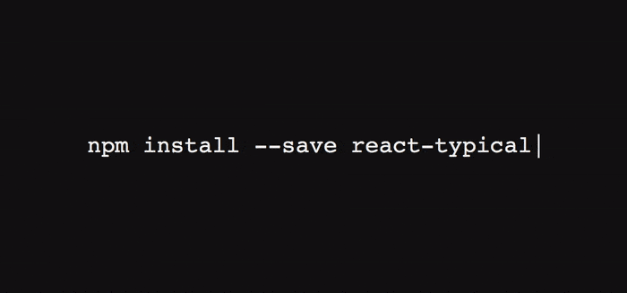

# react-typical
> React Animated typing in ~400 bytes 🐡 of JavaScript.



## Install

```bash
npm install --save react-typical
```

## Usage

```jsx
import React, { Component } from 'react'
import Typical from 'react-typical'

class Example extends React.Component {
  render () {
    return (
      <Typical
        steps={['Hello', 1000, 'Hello world!', 500]}
        loop={Infinity}
        wrapper="p"
      />
    )
  }
}
```

## Properties

prop|mandatory|type|Eg.
|--|--|--|--|
|`steps`|yes|[]|`['Hello', 1000, 'World']`
|`wrapper`|no|string|'p'
|`loop`|no|number|`3`|
